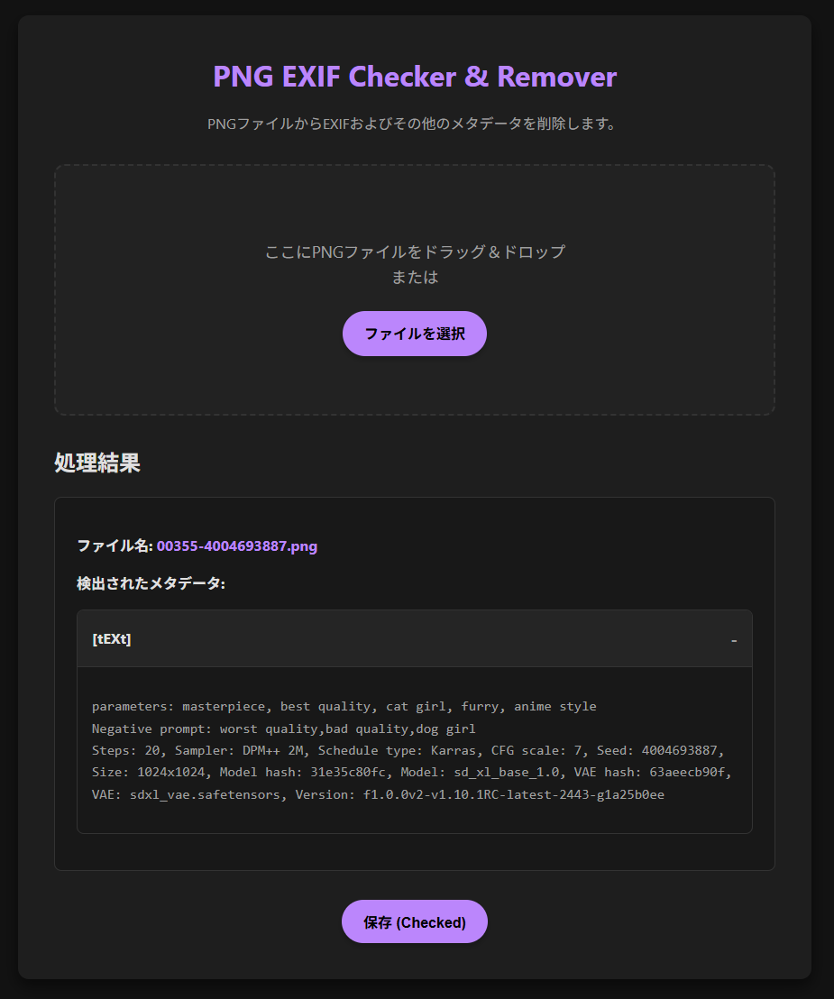

# KabooEXIFChecker

## 概要

このプロジェクトは、png画像からEXIFデータなどを閲覧したり削除したりするツールです

## 使い方

1. index.htmlを開く
2. 画像ファイルを指定する

## イメージ

## ライセンス

このプロジェクトは、MITライセンスの下でライセンスされています。

## 更新履歴

* 2025/11/28: とりあえずロンチ
